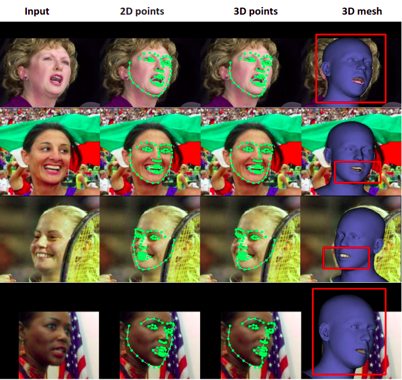

# Weakly Supervised 3D Face Reconstruction in the Wild

 

In this work, reconstruction pipeline is implemented to reconstruct 3D head model from a single image in-the-wild. This work is motivated from [arXiv paper](https://arxiv.org/abs/1905.06817) and [arXiv paper](https://arxiv.org/abs/2012.04012).

**Datasets**
* Menpo benchmark dataset. To access Menpo datbase, you need to drop an email to contact mentioned at this [site](https://ibug.doc.ic.ac.uk/resources/1st-3d-face-tracking-wild-competition/)
* [NoW Challenge](https://ringnet.is.tue.mpg.de/challenge) benchmark dataset
